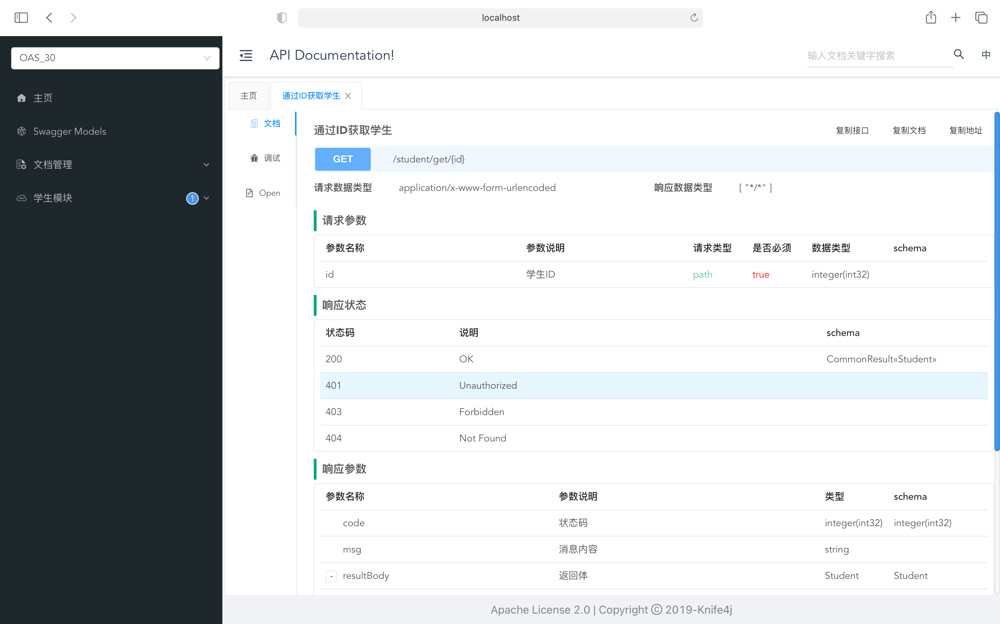

# Swagger + SpringBoot

> 使用Knife4j整合SpringBoot(这里用的是swagger2)
>
> - swagger2 和 swagger3 注解有些不同

## 1.Swagger2常用注解

| 注解                 | 使用的地方     | 用途                                            |
| -------------------- | -------------- | ----------------------------------------------- |
| `@Api`               | 类             | 描述类的主要用途                                |
| `@ApiOperation`      | 方法           | 描述方法的用途                                  |
| `@ApiImplicitParam`  | 方法           | 用于描述接口的单个参数                          |
| `@ApiImplicitParams` | 方法           | 用于描述接口的参数集，包含多个@ApiImplicitParam |
| `@ApiIgnore`         | 类/方法/参数   | Swagger 文档不会显示拥有该注解的接口            |
| `@ApiModel`          | 参数实体类     | 描述参数实体类的主要用途                        |
| `@ApiModelProperty`  | 参数实体类属性 | 描述参数实体类属性的主要用途                    |
| `@ApiResponse`       | 方法           | 描述一个响应信息                                |
| `@ApiResponses`      | 方法           | 描述一组响应信息                                |

-   `@Api`：作用在类上，用来标注该类具体实现内容。 
    -   参数： 
        -   `tags`：该类的名称
        -   `description`：描述该类的作用
-   `@ApiOperation`：表示一个http请求的操作
    -   参数：
        -   `value` ： 接口名称
-   `@ApiImplicitParam`：接口的单个请求参数 ，根据需要选择
    -   参数：
        -   `name` ：参数名 
        -   `value` ： 描述参数名 
        -   `required` ： 该参数是否必填
        -   `dataType` ：参数的数据类型 
        -   `example`：举例 
        -   `paramType` ：查询参数类型。这里有几种形式：

| 类型     | 作用                            |
| -------- | ------------------------------- |
| `path`   | 以地址的形式提交数据            |
| `query`  | 直接跟参数完成自动映射赋值      |
| `body`   | 以流的形式提交 仅支持POST       |
| `header` | 参数在request headers 里边提交  |
| `form`   | 以form表单的形式提交 仅支持POST |

- `@ApiIgnore`表示忽略该方法、类、参数，不显示在`swagger-ui.html`上

## 2.Spring Boot 整合 Knife4j

### 2.1.引`pom.xml`

```xml
<dependency>
    <groupId>com.github.xiaoymin</groupId>
    <artifactId>knife4j-spring-boot-starter</artifactId>
    <version>3.0.2</version>
</dependency>
```

### 2.2写配置

```java
package com.frenude.swagger.config;


import org.springframework.context.annotation.Bean;
import org.springframework.context.annotation.Configuration;
import springfox.documentation.builders.ApiInfoBuilder;
import springfox.documentation.builders.PathSelectors;
import springfox.documentation.builders.RequestHandlerSelectors;
import springfox.documentation.oas.annotations.EnableOpenApi;
import springfox.documentation.service.Contact;
import springfox.documentation.spi.DocumentationType;
import springfox.documentation.spring.web.plugins.Docket;

/**
 * @author: Frenude
 * @mail: frenude@gmail.com
 * @date: created in 06 14,2021
 * @desc: //todo
 */
@Configuration
@EnableOpenApi
public class SwaggerConfiguration {

    public class SwaggerConfig {
        @Bean
        public Docket docket() {
            return new Docket(DocumentationType.OAS_30)
                    .apiInfo(new ApiInfoBuilder()
                            .title("API Documentation!")
                            .description("used knife4j swagger-bootstrap-ui to build")
                            .termsOfServiceUrl("https://github.com/frenude/swagger-ui-item")
                            .contact(new Contact("Frenude", "https://github.com/frenude/swagger-ui-item", "frenude@gmail.com"))
                            .version("1.0")
                            .build())
                    .groupName("OAS_30")
                    .select()
                    //加了ApiOperation注解的方法，才生成接口文档
                    // .apis(RequestHandlerSelectors.withMethodAnnotation(ApiOperation.class))
                    //特定包下的类，才生成接口文档
                    .apis(RequestHandlerSelectors.basePackage("com.frenude.swagger.controller"))
                    .paths(PathSelectors.any())
                    .build();
        }
    }
}
```

### 2.3编写用到的实体

```java
package com.frenude.swagger.entity;

import lombok.AllArgsConstructor;
import lombok.Data;
import lombok.NoArgsConstructor;

/**
 * @author: Frenude
 * @mail: frenude@gmail.com
 * @date: created in 06 14,2021
 * @desc: //todo
 */
@Data
@AllArgsConstructor
@NoArgsConstructor
public class Student {
    private String name;
    private Integer age;
}
```

### 2.4编写`Controller`

```java
package com.frenude.swagger.controller;

import com.frenude.swagger.common.CommonResult;
import com.frenude.swagger.entity.Student;
import io.swagger.annotations.Api;
import io.swagger.annotations.ApiImplicitParam;
import io.swagger.annotations.ApiOperation;
import org.springframework.http.HttpStatus;
import org.springframework.http.ResponseEntity;
import org.springframework.web.bind.annotation.GetMapping;
import org.springframework.web.bind.annotation.PathVariable;
import org.springframework.web.bind.annotation.RequestParam;
import org.springframework.web.bind.annotation.RestController;

import java.util.HashMap;

/**
 * @author: Frenude
 * @mail: frenude@gmail.com
 * @date: created in 06 14,2021
 * @desc: //todo
 */
@Api(tags = "学生模块")
@RestController
public class StudentController {
    private static final HashMap<Integer, Student> map = new HashMap<>();

    static {
        map.put(1, new Student("Doris", 18));
        map.put(2, new Student("Tom", 22));
    }
    @ApiImplicitParam(name = "id",value = "学生ID",required = true)
    @ApiOperation(value = "通过ID获取学生")
    @GetMapping("/student/get/{id}")
    public CommonResult<Student> getStudentById(@PathVariable Integer id) {
        return CommonResult.success(HttpStatus.OK.value(), "Select SUCCESS!", map.get(id));
    }

}
```

### 2.5编写返回实体

```java
package com.frenude.swagger.common;

import io.swagger.annotations.ApiModel;
import io.swagger.annotations.ApiModelProperty;
import lombok.AllArgsConstructor;
import lombok.Data;
import lombok.NoArgsConstructor;

/**
 * @author: Frenude
 * @mail: frenude@gmail.com
 * @date: created in 06 14,2021
 * @desc: //todo
 */
@Data
@ApiModel
@AllArgsConstructor
@NoArgsConstructor
public class CommonResult<T> {
    @ApiModelProperty("状态")
    private Integer status = 1;
    @ApiModelProperty("状态码")
    private Integer code = 200;
    @ApiModelProperty("消息内容")
    private String msg = "";
    @ApiModelProperty("返回体")
    private T resultBody;
    public CommonResult(T resultBody) {
        this.resultBody = resultBody;
    }

    public static <T> CommonResult<T> success(Integer code,String msg,T resultBody)
    {
        CommonResult<T> commonResult = new CommonResult<>();
        commonResult.code = code;
        commonResult.msg = msg;
        commonResult.resultBody=resultBody;
        commonResult.status = 1;
        return commonResult;
    }
    public static <T> CommonResult<T> error(Integer code, String msg){
        CommonResult<T> commonResult = new CommonResult<>();
        commonResult.code = code;
        commonResult.msg = msg;
        commonResult.status = -1;
        return commonResult;
    }
}
```

### 2.6查看API文档

